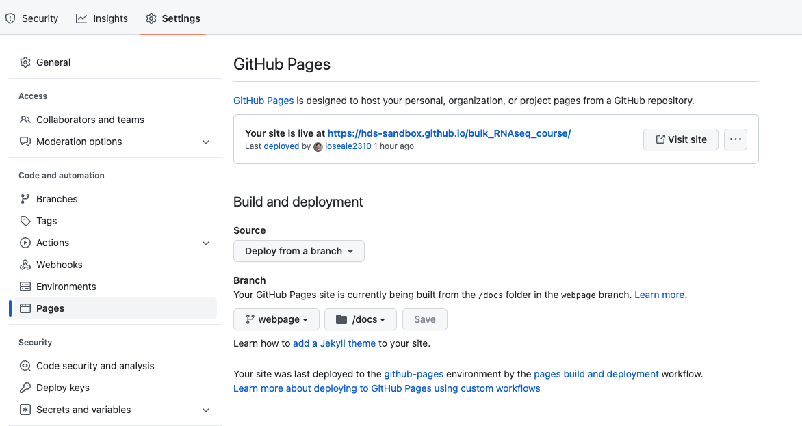
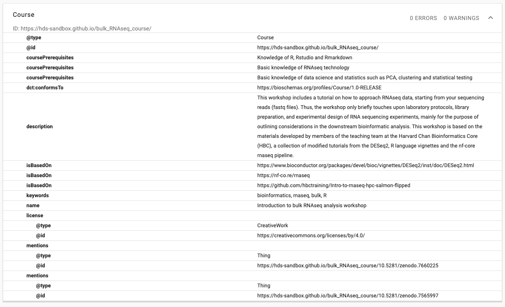
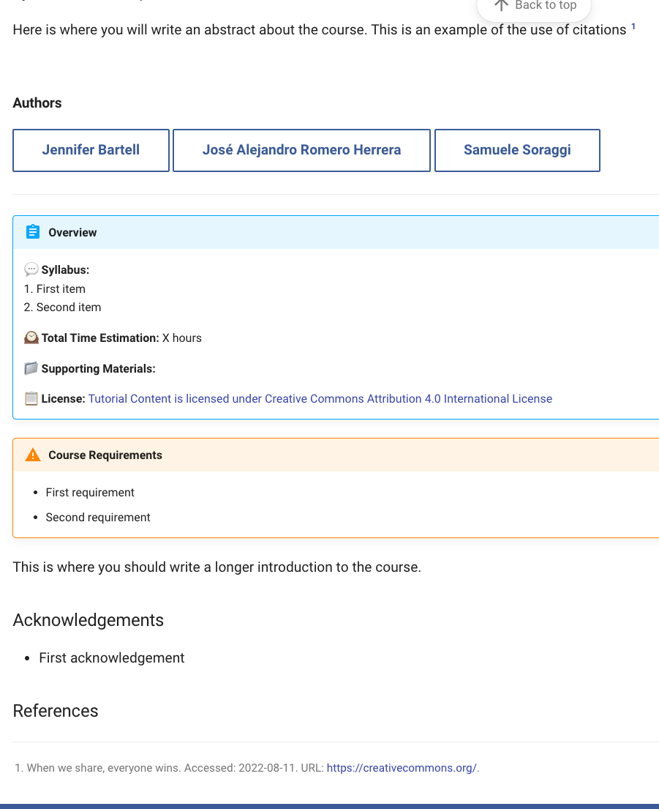

# course-template repo

This repository is a webpage template for courses.

## Requirements

In order to create a webpage from this repo, you will need to have installed [conda or pip](https://docs.conda.io/projects/conda/en/latest/index.html). Then install the following packages using the terminal:

```bash
pip install mkdocs
pip install mkdocs-material
pip install mkdocs-video
pip install mkdocs-bibtex 
pip install neoteroi-mkdocs
```

## Usage

I would recommend that all the webpage source materials should be saved in an independent branch of the repo (maybe call it webapage). The template should look like this:

```
course-template/
    |
    |-> develop/ # This folder contains the source material
    |   |-> cards/ This folder contains the content of the social cards in yaml format
    |   |
    |   |-> images/ # This folder contains all the images for the webpage as well as the favicon and the logo
    |   |
    |   |-> stylesheets/
    |   |   |-> extra.css # This file contains formatting of the webpage: colors and fonts
    |   |   |-> neoteroi-mkdocs.css # formatting of the social cards
    |   |   
    |   |-> *.md # These will be individual webpages that should be inside the mkdocs.yml navigation tree
    |
    |-> docs/ # This folder contains the built webpage
    |
    |-> overrides/ # This folder overrides basic html templates
    |
    |-> mkdocs.yml # This is the configuration file of the webpage
    |
    |-> references.bib # List fo referfences in bib format
```

You should develop the materials for the webpage in markdown format (.md) in the `develop` folder. Mkdocs should also handle Jupypter notebooks (.ipynb) files as well. You can also develop materials in Rmarkdown, but then you should knit the document as shown in the `rmarkdown_example.md`. Ideally, all the images of the .md files will link to the `develop/images` folder.

Once you have created your materials inside the `develop` folder, you can test the website using:

```bash
mkdocs serve
```
**NOTE**: remember to set the working directory to {course-name} general folder, otherwise mkdocs will not be able to find the mkdocs.yml file.

This will prompt a local link were you can check how the webpage will look (usually it is http://127.0.0.1:8000/). 
Then, if you are happy with how it looks, you can build the website:

```bash
mkdocs build
```

This will create the webpage in the `docs` folder. It is necessary that the webpage is created in this folder so that Github Pages can fetch it properly. To set up the Github Pages, go to the **`Settings`** of the repo in [github.com](https://github.com/). Then click on **`Pages`** and set up the **`Build and deployment section`** as below:



Where:
-   **`Source`** is *`Deploy from a branch`*
-   In **`Branch`**:
    -   **`Select branch`** is *`webpage`* or the name of the branch were this material is
    -   **`Select folder`** is *`/docs`*

When you click on **`Save`**, the webpage should be activated shortly afterwards in the displayed at the top.

### Bioschemas

The file `overrides/main.html` will override a block of the generated html files to add a bioschema to the webpage. 
A [Bioschema](https://bioschemas.org/) aims to improve the Findability on the Web of life sciences resources such as datasets, software, and training materials, adhering it to FAIR data principles.

I have made a template with the bioschema "Course" that contains a the mandatory fields and a couple of recommeded ones. You must change all the fields where the text starts with a `#`, for example:

```
 "@context": "https://schema.org",
  "@id": "https://hds-sandbox.github.io/#your-course-name",
  "@type": "Course",
  "coursePrerequisites": [
    "#Prerequisite 1",
    "#Prerequisite 2",
    "#Prerequisite 3"
```

Preserve the quotes and exchange those fields for the appropiate ones in your course:

```
"@context": "https://schema.org",
  "@id": "https://hds-sandbox.github.io/bulk_RNAseq_course/",
  "@type": "Course",
  "coursePrerequisites": [
    "Knowledge of R, Rstudio and Rmarkdown",
    "Basic knowledge of RNAseq technology",
    "Basic knowledge of data science and statistics such as PCA, clustering and statistical testing"
  ],
```

Once you build and push the new webpage to GitHub Pages, you can test that the bioschema works by using a [schema validator](https://validator.schema.org/) and entering the url of the webpage (for example: https://hds-sandbox.github.io/bulk_RNAseq_course/)



If you want to create a new template or modify this one, I recommend that you use the [Bioschema Generator tool](http://www.macs.hw.ac.uk/SWeL/BioschemasGenerator/).

## References

References can be used throughout the documentation. They are very easy to use. First, add your citations/references in bib formart to the file `references.bib`. For example:

```
@misc{creative_commons_2022, 
title={When we share, everyone wins}, 
url={https://creativecommons.org/}, 
publisher={Creative Commons}, 
note = {Accessed: 2022-08-11}
} 
```

There are two types of references:
- `@article`: for articles
- `@misc`: for anything else

The first name (in the previous example, creative_common_2022) is an identifier that you can use to reference later in the markdown. To reference an entry from the `reference.bib` file, use square brackets along with `@` and the identifier for that reference [@creative_commonds_2022].

Add `\bibliography` at the end of your markdown document to create a footnote with the references.



## Tags

You can add tags to the yaml header of a markdown document. Think of tags as keywords for a page. This will make it easier to find certain topics like "QC" or "visualizations". For example

```
---
tags:
    - QC
    - Visualizations
---
```

If you leave the `keywords.md` in the navigation index of the `mkdocs.yml`, you will find a index of keywords and in which page do they appear. You can remove this page and still be able to use the keywords to in the search bar with no issues, you will just remove the keyword index page.

## Contributors

Lastly I have put a `contributors.md` file that can serve as an example for the course contributors, although the "Authors" block in `index.md` serve the same purpose. You can remove this one if you want

Ideally, one would have a [CRediT matrix](https://credit.niso.org/), but it seems overly complicated:

| CRediT role                                                                                     | Initials |
|-------------------------------------------------------------------------------------------------|----------|
| [Conceptualization](https://credit.niso.org/contributor-roles/conceptualization/)               |          |
| [Data curation](https://credit.niso.org/contributor-roles/data-curation/)                       |          |
| [Formal Analysis](https://credit.niso.org/contributor-roles/formal-analysis/)                   |          |
| [Funding acquisition](https://credit.niso.org/contributor-roles/funding-acquisition/)           |          |
| [Investigation](https://credit.niso.org/contributor-roles/investigation/)                       |          |
| [Methodology](https://credit.niso.org/contributor-roles/methodology/)                           |          |
| [Project administration](https://credit.niso.org/contributor-roles/project-administration/)     |          |
| [Resources](https://credit.niso.org/contributor-roles/resources/)                               |          |
| [Software](https://credit.niso.org/contributor-roles/software/)                                 |          |
| [Supervision](https://credit.niso.org/contributor-roles/supervision/)                           |          |
| [Validation](https://credit.niso.org/contributor-roles/validation/)                             |          |
| [Visualization](https://credit.niso.org/contributor-roles/visualization/)                       |          |
| [Writing - original draft](https://credit.niso.org/contributor-roles/writing-original-draft/)   |          |
| [Writing - review & editing](https://credit.niso.org/contributor-roles/writing-review-editing/) |          |


## Authors cards

You can add social cards to a markdown document in two different ways:

**1. Write directly on the markdown file**

```
::cards::

- title: Jose Alejandro Romero Herrera
  content: Data Scientist [:custom-orcid:](https://orcid.org/0000-0002-4765-2087) [:simple-github:](https://github.com/joseale2310)
  image: ./images/cards/jarh.jpeg

::/cards::
```

**2. Create a yaml file with all the content**

You can create a yaml file with the content like this:

```
- title: Jennifer Bartell
  content: |
    Project Coordinator and Data Scientist <br>
    [:custom-orcid:](https://orcid.org/0000-0003-2750-9678) [:simple-github:](https://github.com/jenbartell)
  image: https://media.licdn.com/dms/image/C4E03AQGtFrDPj3gkmw/profile-displayphoto-shrink_400_400/0/1646839294717?e=1684368000&v=beta&t=pTEBcTvZKQXQFLp4VEwLXs7nnahQ1uclrrqbdXrCVnU

```

And then add to a markdown file like this:

```
[cards cols="4"(./develop/cards/cards.yaml)]
```

By default you can only provide 1 to 6 columns.
