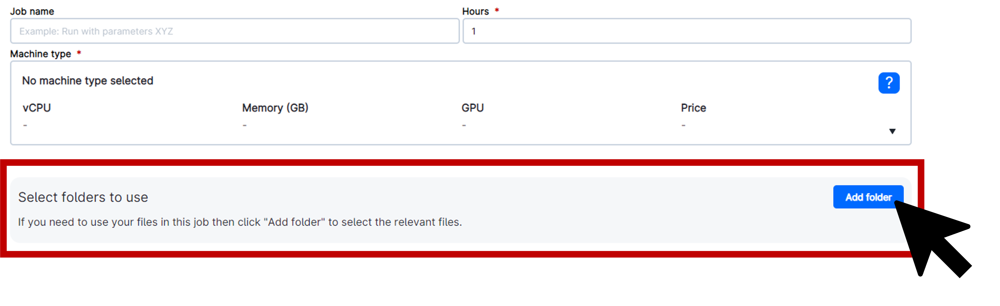

<!--
# Put above to hide navigation (left), toc (right) or footer (bottom)

hide:
  - navigation 
  - toc
  - footer 

# You should hide the navigation if there are no subsections
# You should hide the Table of Contents if there are no important titles
-->

# ColabFold

!!! note "Section Overview"

    &#128368; **Time Estimation:** 4 hours

    &#128172; **Learning Objectives:**    
        1. Explain the process of predicting protein structures based on amino acid sequences using the ColabFold web application.  
        2. Utilize the ColabFold web application within the UCloud environment to perform complex computational tasks with optimal performance.  
        3. Understand the metrics used by AlphaFold2 to predict protein structure models and how they relate to the confidence and accuracy of the predictions.  

## Introduction    

ColabFold is a web application that allows users to predict protein structures from sequence data. The application is based on the AlphaFold2 algorithm, which is a deep learning model that predicts protein structures from sequence data. The ColabFold application is a simplified version of the AlphaFold2 algorithm, which is designed to be used by non-computational researchers. The ColabFold application is available on the Clinical Proteomics Sandbox website and can be accessed at UCloud. 

### Getting Started
You can access ColabFold through UCloud. This integration allows you to use the tool, but before beginning the ColabFold workshop, you need to download the workshop as a Jupyter Notebook from [GitHub](https://github.com/hds-sandbox/AlphaFold_Workshop) and upload it to your designated folder on UCloud. To initiate this process, please follow the steps below:

:one: Log in to UCloud.  
:two: Choose a workspace that has GPU resources for optimal performance.  
:three: Access the application menu by clicking on **Apps** in the left-hand side menu.  

:three: Search for **ColabFold** and click on the icon for the application.  

:four: Choose the appropriate machine type and select a GPU, such as **u2-gpu-1**. The use of a single GPU is generally sufficient, though larger sequences may require additional computational power.  

:five: Deploy your own personal folder by selecting **Folder** and adjusting the path to your directory. Be sure to select the correct **Workspace** and change the **Drive** to where you want your data to be stored, if needed. Click on the folder name to select it and then click **Use this folder** in the upper right corner of the pop-up window.  

:six: Click on "Submit" and then "Open interface" on the following page.  

:seven: Prior to proceeding, ensure you've downloaded the Jupyter Notebook labeled **AlphaFold2.ipynb** from [the Github repository](https://github.com/hds-sandbox/AlphaFold_Workshop). Then, upload the notebook to your ColabFold session using the left-hand menu.

:eight: Proceed with the ColabFold workshop, which will guide you through the process of predicting protein structures based on amino acid sequences.  

### Efficient Super-Computing with ColabFold
!!! info "Advantages of using ColabFold at UCloud"
    1. ColabFold at UCloud provides access to super-computing power, enabling users to perform complex computational tasks quickly and efficiently.  
    2. The user-friendly interface of ColabFold and UCloud's interactive HPC-environment make it easy for non-computational users to access and utilize the tool.  
    3. Using ColabFold at UCloud can be a cost-effective solution for those who require access to super-computing power, as it eliminates the need for expensive hardware or software investments and offers a pay-per-use basis instead.
