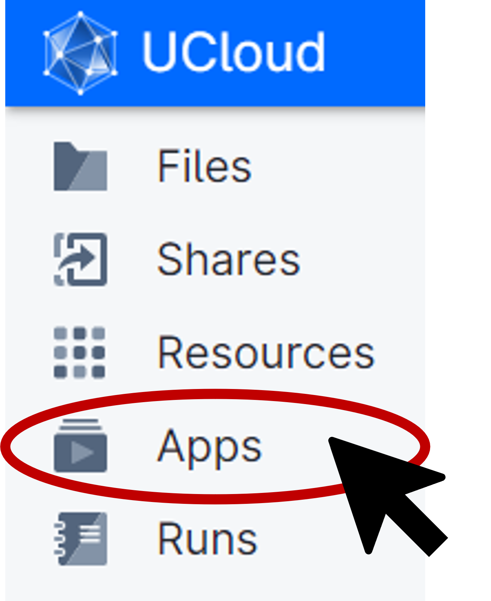
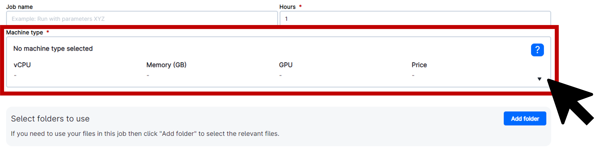
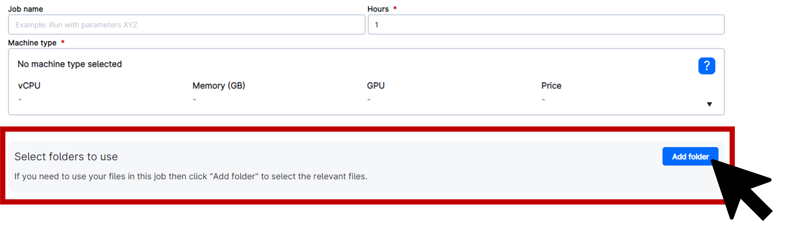
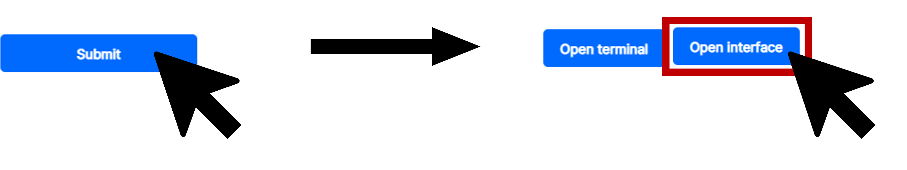

<!--
# Put above to hide navigation (left), toc (right) or footer (bottom)

hide:
  - navigation 
  - toc
  - footer 

# You should hide the navigation if there are no subsections
# You should hide the Table of Contents if there are no important titles
-->

# Setup

!!! note "Section Overview"

    &#128368; **Total Time Estimation:** 10 minutes

    &#128172; **Learning Objectives:**    
        1. Launch the Proteomics Sandbox App and become proficient in using it for proteomics data analysis.  
        2. Deploy your own data in the Proteomics Sandbox app.   

## Launch the Proteomics Sandbox application in UCloud  

Below are step-by-step instructions on how to launch the Proteomics Sandbox application in UCloud.  

:one: Navigate to the workspace where your data is located.  
:two: Access the application menu by clicking on **Apps** in the left-hand side menu.  

:three: Search for **Proteomics Sandbox** and click on the icon for the application.  

:four: Select your desired number of resources under **Machine type**. Remember, larger datasets will require more resources.  

:five: Deploy your data by selecting **Folder** and adjusting the path to your files. Be sure to select the correct **Workspace** and change the **Drive** to where your data is located. Click on the folder name to select it and then click **Use this folder** in the upper right corner of the pop-up window.  

:six: Once you have deployed your data, you are ready to launch the application. Click on **Submit** to the right of the screen and then click **Open interface** in the upper right corner of the following page to start using the Proteomics Sandbox application.  

Congratulations! You're now ready to dive into the world of clinical proteomics and perform various analyses with the user-friendly Proteomics Sandbox app. For more detailed instructions on how to use the software available in the app, check out the official documentation for the software linked in the [overview table](/proteomics-sandbox/gettingstarted.html#software). 

!!! danger "Important Warning"
    1. When working within the Proteomics Sandbox application, **it is crucial to ensure that all your work is saved in the designated 'work' directory**. Failure to do so may result in permanent loss of your work when the session ends or expires.  
    2. It is imperative to **keep track of the time allocated for your UCloud job**. Upon expiry, the session will terminate automatically, resulting in loss of unsaved work. It is possible to extend the number of hours for your session after it has commenced.
