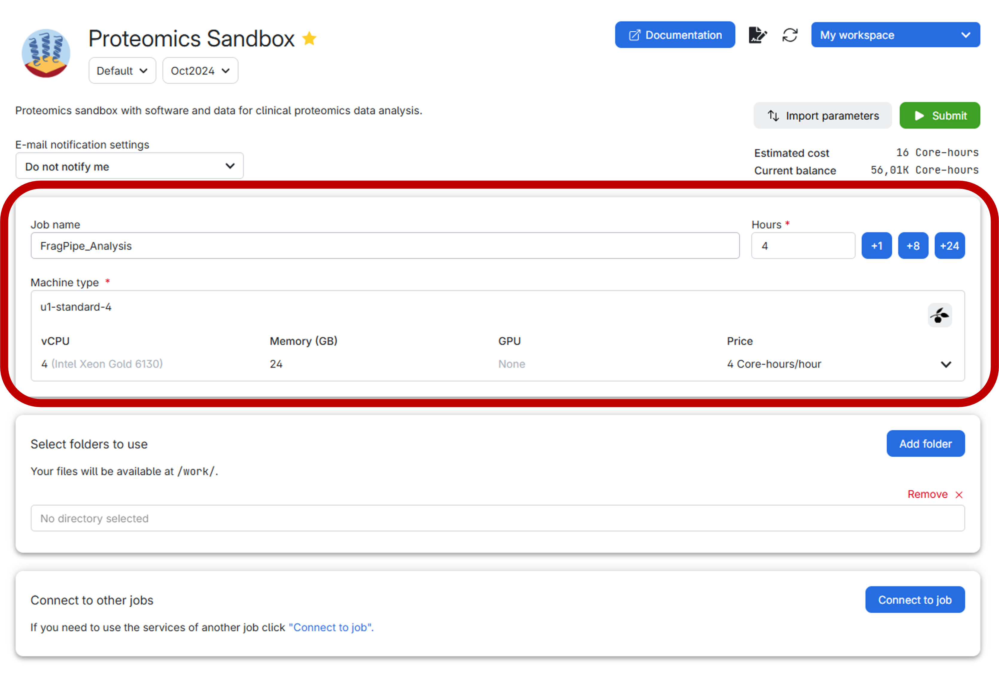
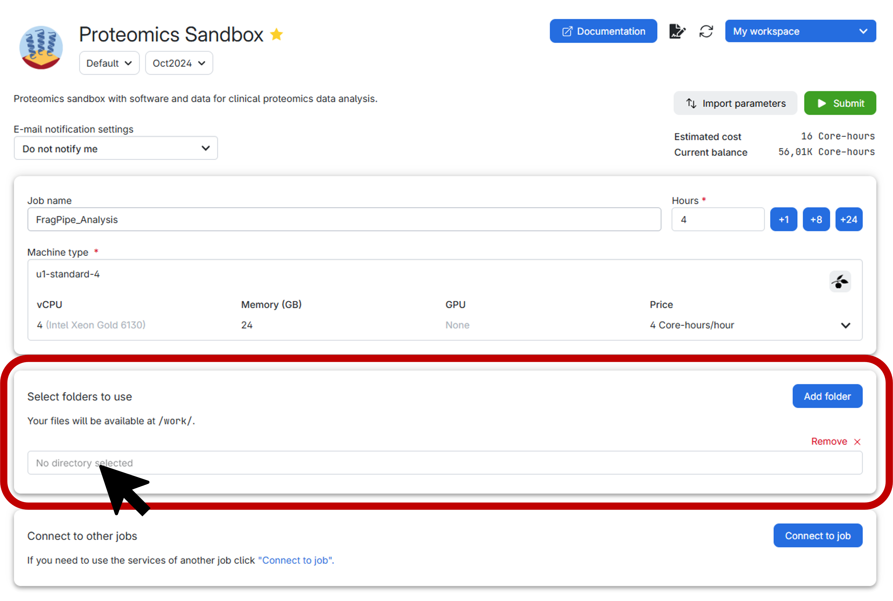
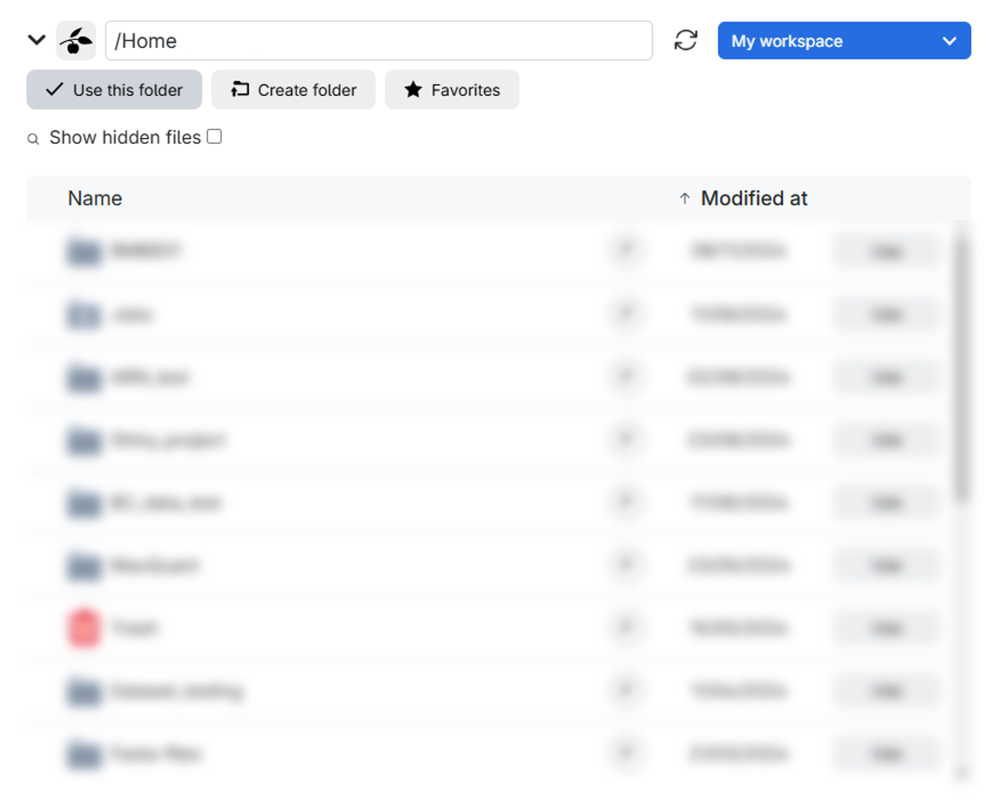

:::{.callout-note title="Section Overview"}

&#128368; **Time Estimation:** 20 minutes

&#128172; **Learning Objectives:**

1. Launch the Proteomics Sandbox App and become proficient in using it for proteomics data analysis.
2. Familiarize oneself with the software tools available within the app, such as FragPipe, MaxQuant, PDV, SearchGUI, and PeptideShaker.
3. Develop skills in utilizing the Proteomics Sandbox App's lightweight clone feature, in order to reduce storage requirements while analyzing large datasets.

:::

## Getting started

You can access the **Proteomics Sandbox Application** on UCloud [here](https://cloud.sdu.dk/app/jobs/create?app=proteomics).

In UCloud, the settings should look like this:

{width=750 fig-align="center"}

Before submitting the job, it is highly recommended to create a personal folder to securely store both your data and the results. Follow the step-by-step guide below for an effortless setup:

1. First, click on the vibrant blue `Add folder` button.
2. Next, select the exact directory you wish to mount, as illustrated below:

{width=750 fig-align="center"}

Upon clicking, a window similar to the one below will appear. Here, you have the option to either create a specific folder within a particular drive in the workspace you’ve chosen or simply select the entire drive itself. In this example, the drive is labeled as `Home` and the workspace is `My workspace`.

{width=750 fig-align="center"}

:::{.callout-caution title="Important warning"}

1. When working with the Proteomics Sandbox application, **it is crucial to ensure that all your work is saved in the designated `/work` directory**.
   Failure to do so may result in permanent loss of your work when the session ends or expires.
2. It is imperative to **keep track of the time allocated for your UCloud job**. Upon expiry, the session will terminate automatically, resulting in loss of unsaved work.
   It is possible to extend the number of hours for your session after it has commenced.
:::

Wait until your application is started, then click **"Open Interface"** and enjoy!

## Software

The software available in the Proteomics Sandbox includes [FragPipe](https://fragpipe.nesvilab.org/), [MaxQuant](https://www.maxquant.org/),
[PDV](https://github.com/wenbostar/PDV), [SearchGUI](https://compomics.github.io/projects/searchgui.html),
[ThermoRawFileParser](https://github.com/compomics/ThermoRawFileParser), [PeptideShaker](https://compomics.github.io/projects/peptide-shaker.html),
[MZmine](https://mzmine.github.io/), [DIA-NN](https://github.com/vdemichev/DiaNN), [VMD](https://www.ks.uiuc.edu/Research/vmd/),
[OpenMS](https://openms.de) and the [PRIDE submission tool](https://www.ebi.ac.uk/pride/markdownpage/pridesubmissiontool).
These software tools provide automated peptide and protein identification and quantification, comprehensive proteomics data analysis,
visualization tools for spectral matches, a user-friendly interface for performing peptide searches,
and a tool for visualizing and analyzing peptide search results, as well as other data management and analysis tasks.
An overview table with a short description of each software tool is listed below for reference.

| Software      | Description                                                                                                                                                    |
| ------------- | -------------------------------------------------------------------------- |
| [FragPipe](https://fragpipe.nesvilab.org/)      | Automated peptide and protein identification and quantification using the MSFragger search engine. Supports the identification of arbitrary PTMs. Includes additional tools for post-processing and visualization of search results. |
| [MaxQuant](https://www.maxquant.org/)      | Comprehensive software suite for proteomics data analysis. Includes protein and peptide identification, quantification, and visualization of spectral matches. Features an advanced search engine; only the command-line tool is available on Linux as the GUI is incompatible. |
| [PDV](https://github.com/wenbostar/PDV)           | Visualization tool for spectral matches, particularly those obtained from MSFragger searches. Allows users to inspect and evaluate the quality of the matches. Supports annotation and customization of plots. |
| [SearchGUI](https://compomics.github.io/projects/searchgui.html)     | User-friendly interface for performing peptide searches using multiple search engines (e.g., MSFragger, X!Tandem, OMSSA). Supports a wide range of search options and post-processing features. |
| [ThermoRawFileParser](https://github.com/compomics/ThermoRawFileParser) | A tool for converting Thermo Scientific RAW files to an open format mzML file that can be read by other proteomics software. Includes options for filtering, peak picking, and data conversion. |
| [PeptideShaker](https://compomics.github.io/projects/peptide-shaker.html) | Tool for visualizing and analyzing the results of peptide searches performed with SearchGUI. Includes features for filtering, annotation, and visualization of results. Supports integration with other proteomics databases and software. |
| [MZmine](https://mzmine.github.io/) | Open-source software for LC-MS data processing. It offers a flexible, user-friendly platform with modules for the full LC-MS data analysis workflow. |
| [DIA-NN](https://github.com/vdemichev/DiaNN) | DIA-NN is a universal tool for DIA proteomics data. It features robust algorithms for reliable, large-scale experiments, emphasizing ease of use, reproducibility, and high throughput, processing up to 1000 runs per hour. |
| [VMD](https://www.ks.uiuc.edu/Research/vmd/) | Visual Molecular Dynamics (VMD) is a molecular visualization program for displaying, animating, and analyzing large biomolecular systems using 3D graphics and built-in scripting. Supports various molecular dynamics simulations and bioinformatics analyses. |
| [OpenMS](https://openms.de) | A a free, open-source framework for LC-MS data amangement and analysis. It includes a C++ library with Python bindings and a collection of command-line tools. |
| [PRIDE submission tool](https://www.ebi.ac.uk/pride/markdownpage/pridesubmissiontool) | A GUI application allowing you to submit your proteomics dataset directly from UCloud to the PRIDE archive. |